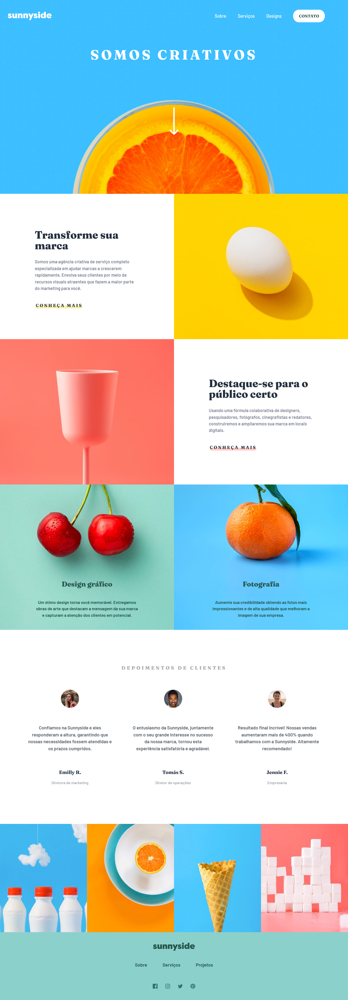

# AGÊNCIA DE PROPAGANDA SUNNYSIDE

## Conteúdo

- [AGÊNCIA DE PROPAGANDA SUNNYSIDE](#agência-de-propaganda-sunnyside)
  - [Conteúdo](#conteúdo)
    - [Imagem](#imagem)
    - [GitPage](#gitpage)
    - [Desenvolvido Com](#desenvolvido-com)

### Imagem

### GitPage

- GitPage: [Agência de Propaganda Sunnyside](https://marcelacostaa.github.io/agencia-de-propaganda-sunnyside/)

### Desenvolvido Com

- HTML5 semântico
- Flexbox
- CSS Grid
- SASS
- Media Queries
- JavaScript

Esta é uma solução para  [Sunnyside agency landing page challenge on Frontend Mentor](https://www.frontendmentor.io/challenges/sunnyside-agency-landing-page-7yVs3B6ef).
