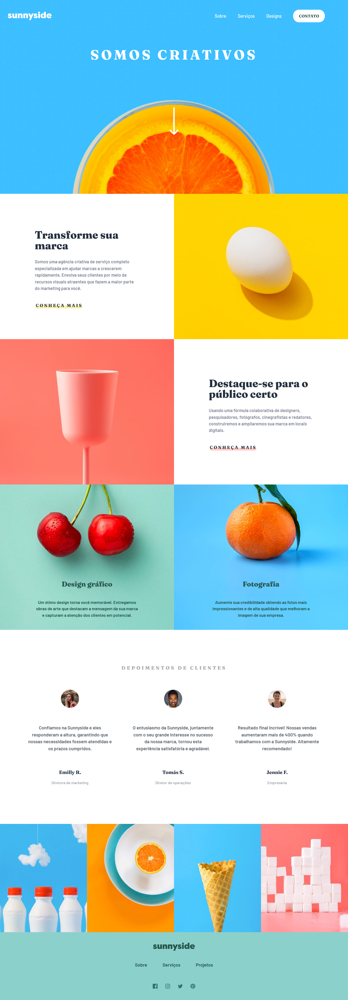

# AGÊNCIA DE PROPAGANDA SUNNYDALE

## Conteúdo

- [AGÊNCIA DE PROPAGANDA SUNNYDALE](#agência-de-propaganda-sunnydale)
  - [Conteúdo](#conteúdo)
    - [Imagem](#imagem)
    - [GitPage](#gitpage)
    - [Desenvolvido Com](#desenvolvido-com)
    - [Recursos](#recursos)

### Imagem

### GitPage

- GitPage: [Agência de Propaganda Sunnydale]()

### Desenvolvido Com

- HTML5 semântico
- Flexbox
- CSS Grid
- SASS
- Media Queries
- JavaScript

### Recursos

- [Clamp Generator](https://www.example.com) - This helped me for XYZ reason. I really liked this pattern and will use it going forward.

Esta é uma solução para  [Sunnyside agency landing page challenge on Frontend Mentor](https://www.frontendmentor.io/challenges/sunnyside-agency-landing-page-7yVs3B6ef).
